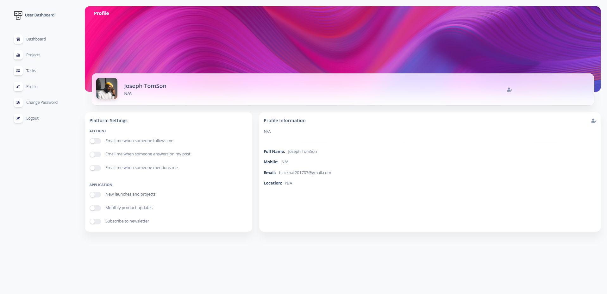

# Project and Task management with Laravel
RESTful API + Passport Authentication || JQuery + Ajax.

## Feature
Key Feature of Project.

- Backend API using Laravel with Passport.
- Real World Calling Api with Front End Dashboard
- Custom Authentication System (without jetstream)
- Register,Login And Dashboard Design
- Run Local Environment
- Responsive Template
- Use Real-World Project
- Authorized User Using Passport Token.
- Front End Project Call Laravel passport Api using AJAX.

